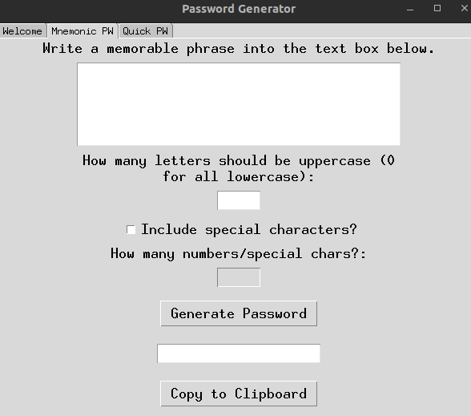

# Password Generator

This is a simple password generator that allows users to generate secure passwords. It has two options:

<ul><li>Mnemonic PW:  The user enters a memorable phrase and the password generator creates a password based on the first letter of each word. In addition, there is the possibility to add randomized uppercase to the letters and random numbers/special characters.   Note:  Punctuation marks are removed before the password is generated, and if numbers are included, they are taken as such.
</li>

<li>Quick PW: The user enters the desired length of the password and the password generator creates a random password with that length.</li></ul>

The password generator also includes a function to copy the generated password to the clipboard.

## Screenshot
-------

## Requirements
-------
<ul>
<li>Python 3.8+ </li>
<li> tkinter</li>
<li> pyperclip</li>
</ul>

## Usage
-----

To use the password generator, first open the `password_generator.py` file in a Python interpreter. Run the code and the GUI will appear.

## License
-------

This project is licensed under the MIT License.

## Notes
-----
<ul>
<li>This is my first Python project.</li>
<li>I am open to feedback and suggestions.</li>
</ul>

